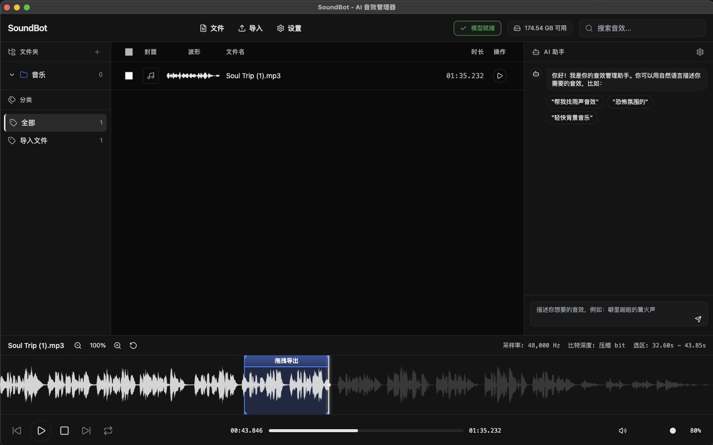
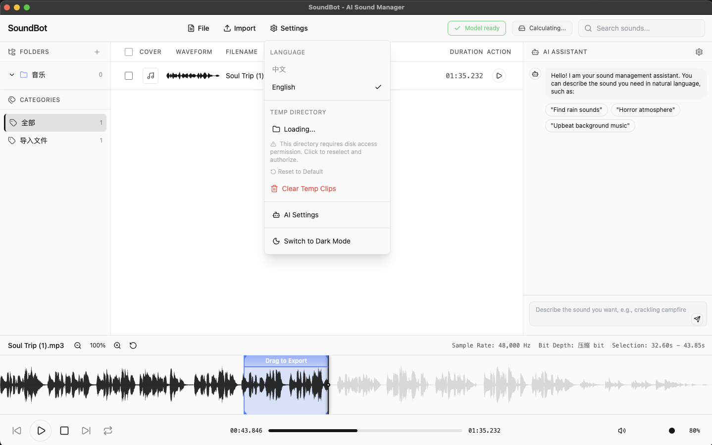

# 🎵 SoundBot - AI 音效管理器 / AI Sound Effect Manager

[](https://www.gnu.org/licenses/gpl-3.0)
[](https://github.com/Huckrick/SoundBot)
[](https://www.python.org/)
[](https://www.electronjs.org/)

> 用自然语言找到你想要的任何声音 - AI 驱动的智能音效管理器桌面版  
> Find any sound you want using natural language - AI-powered intelligent sound effect manager for desktop

---

## 📥 下载 / Download

[](https://github.com/Huckrick/SoundBot/releases/latest)  
[](https://github.com/Huckrick/SoundBot/releases/latest)

**最新版本 / Latest Release**: [v0.1.0-alpha](https://github.com/Huckrick/SoundBot/releases/latest)

### 界面预览 / Screenshot

  


---

## 📝 关于本项目 / About This Project

**开发环境 / Development Environment**：本项目完全在 macOS 环境下开发和测试  
This project was developed and tested entirely in a macOS environment.

**开发背景 / Development Background**：
- 开发者 / Developer：**Nagisa_Huckrick (胡杨)**
- 📧 联系邮箱 / Contact Email：**Nagisa_Huckrick@yeah.net**
- 🐙 GitHub：[@Huckrick](https://github.com/Huckrick)

**重要声明 / Important Statement**：
> ⚠️ **本人并非专业程序员，不具备编程背景。本项目全部代码均由 AI 编程工具（Trae、Cursor 等）辅助生成，本人主要负责产品构思、功能设计和测试验证。**  
> ⚠️ **I am not a professional programmer and have no programming background. All code in this project was generated with the assistance of AI programming tools (Trae, Cursor, etc.). I am primarily responsible for product conception, feature design, and testing verification.**

**致谢 / Acknowledgments**：
特别感谢以下 AI 编程工具对本项目的支持 / Special thanks to the following AI programming tools for supporting this project：
- [Trae](https://www.trae.ai/) - 主要开发工具 / Primary development tool
- [Cursor](https://cursor.sh/) - 辅助开发工具 / Auxiliary development tool

---

## ⚠️ 免责声明 / Disclaimer

**使用风险 / Usage Risks**：
1. 本软件按"原样"提供，不提供任何明示或暗示的担保  
   This software is provided "as is" without any express or implied warranties.
2. 使用本软件产生的任何数据丢失或损坏，开发者不承担责任  
   The developer is not responsible for any data loss or damage caused by using this software.
3. 请在使用前备份重要数据  
   Please backup important data before use.

**版权与许可 / Copyright and License**：
- 本项目采用 **GPL-3.0** 开源许可证  
  This project is licensed under **GPL-3.0** open source license.
- 您可以自由使用、修改和分发，但修改后的版本必须开源  
  You are free to use, modify, and distribute, but modified versions must be open source.
- 禁止将本软件用于非法用途  
  It is prohibited to use this software for illegal purposes.

**第三方服务 / Third-Party Services**：
- AI 功能需要连接第三方 LLM 服务（OpenAI、Claude 等）  
  AI features require connection to third-party LLM services (OpenAI, Claude, etc.).
- 使用这些服务需遵守各自的服务条款  
  Use of these services is subject to their respective terms of service.
- 开发者不对第三方服务的可用性或数据处理方式负责  
  The developer is not responsible for the availability or data processing of third-party services.

**音频文件 / Audio Files**：
- 本软件仅提供音效管理功能，不包含任何音频素材  
  This software only provides sound effect management functionality and does not contain any audio materials.
- 用户需自行确保拥有导入音频文件的合法使用权  
  Users must ensure they have legal rights to use the imported audio files.

---

## ✨ 核心特性 / Core Features

### 🤖 AI 自然语言搜索 / AI Natural Language Search
- **描述即搜索** - 用自然语言描述音效（如"很闷的撞击声"、"下雨天在窗户边的雨声"）  
  **Describe to Search** - Describe sounds in natural language (e.g., "dull thud", "rain by the window")
- **智能关键词提取** - AI 自动分析需求并提取搜索关键词  
  **Smart Keyword Extraction** - AI automatically analyzes requirements and extracts search keywords
- **流式响应** - 实时看到 AI 思考和搜索结果  
  **Streaming Response** - See AI thinking and search results in real-time

### 🔍 语义向量搜索 / Semantic Vector Search
- **CLAP 音频-文本对齐模型** - 基于 LAION 的对比学习预训练模型  
  **CLAP Audio-Text Alignment Model** - Based on LAION's contrastive learning pre-trained model
- **ChromaDB 向量数据库** - 高效的相似度检索，支持大规模音效库  
  **ChromaDB Vector Database** - Efficient similarity retrieval, supporting large-scale sound libraries
- **增量索引** - 只处理新文件，快速更新音效库  
  **Incremental Indexing** - Only process new files for quick library updates

### 🎛️ 多 LLM 支持 / Multi-LLM Support
| 提供商 / Provider | 状态 / Status | 说明 / Description |
|--------|------|------|
| LM Studio | ✅ | 本地部署，隐私优先 / Local deployment, privacy-first |
| Ollama | ✅ | 开源模型，离线使用 / Open source models, offline use |
| OpenAI | ✅ | GPT-4o-mini 等 / GPT-4o-mini, etc. |
| Claude | ✅ | Anthropic API |
| DeepSeek | ✅ | 国产大模型 / Chinese LLM |
| Kimi | ✅ | Moonshot API |
| Gemini | ✅ | Google AI |

### 🎨 现代化界面 / Modern Interface
- **深色/浅色主题** - 一键切换，护眼设计  
  **Dark/Light Theme** - One-click switching, eye-friendly design
- **波形可视化** - WaveSurfer.js 实时音频波形  
  **Waveform Visualization** - WaveSurfer.js real-time audio waveform
- **多工程管理** - 项目隔离，数据安全  
  **Multi-Project Management** - Project isolation, data security
- **国际化支持** - 中英文界面切换  
  **Internationalization** - Chinese/English interface switching

---

## 🏗️ 项目架构 / Project Architecture

```
SoundBot/
├── 📦 Electron 前端 / Frontend
│   ├── main.js              # 主进程 / Main process
│   ├── preload.js           # 预加载脚本 / Preload script
│   ├── index.html           # 渲染页面 / Render page
│   └── assets/              # 静态资源 / Static assets
│
├── 🐍 Python 后端 / Backend
│   ├── main.py              # FastAPI 服务入口 / Service entry
│   ├── config.py            # 配置管理 / Configuration
│   ├── core/
│   │   ├── embedder.py      # CLAP 模型封装 / CLAP model wrapper
│   │   ├── indexer.py       # 音频索引逻辑 / Audio indexing
│   │   ├── searcher.py      # 语义搜索实现 / Semantic search
│   │   └── llm_manager.py   # LLM 服务管理 / LLM management
│   ├── models/
│   │   └── schemas.py       # Pydantic 数据模型 / Data models
│   └── db/
│       └── soundmind.db     # SQLite 数据库 / Database
│
├── 🤖 AI 模型 / AI Models
│   └── models/
│       └── clap-htsat-fused/  # LAION CLAP 模型 / LAION CLAP model
│
└── ⚙️ 配置 / Configuration
    └── config/
        └── ai_config.json   # AI 服务配置 / AI service config
```

---

## 🚀 快速开始 / Quick Start

### 系统要求 / System Requirements

| 平台 / Platform | 最低要求 / Minimum Requirements |
|------|----------|
| macOS | 11.0+ (Big Sur), Apple Silicon/Intel |
| Windows | Windows 10/11 64-bit |
| Linux | Ubuntu 20.04+, Debian 11+ |

**硬件要求 / Hardware Requirements**：
- 内存 / RAM：4GB+（推荐 8GB / recommended 8GB）
- 磁盘 / Disk：2GB 可用空间（含 AI 模型 / including AI models）

### 安装步骤 / Installation Steps

1. **下载安装包 / Download Installer**
   - 访问 / Visit [Releases](https://github.com/Huckrick/SoundBot/releases) 页面
   - 下载对应系统的安装包 / Download the installer for your system

2. **macOS 安装 / macOS Installation**
   ```bash
   # 下载 .dmg 文件后双击安装
   # Download .dmg and double-click to install
   # 首次运行可能需要 / First run may require:
   # 系统偏好设置 → 安全性与隐私 → 允许打开
   # System Preferences → Security & Privacy → Allow
   ```

3. **Windows 安装 / Windows Installation**
   ```bash
   # 运行 .exe 安装程序
   # Run the .exe installer
   # 按向导完成安装
   # Follow the wizard to complete installation
   ```

4. **首次启动 / First Launch**
   - 应用会自动下载并加载 AI 模型（约需 10-30 秒）  
     The app will automatically download and load AI models (takes 10-30 seconds)
   - 模型文件会缓存到本地，下次启动更快  
     Model files will be cached locally for faster subsequent launches

---

## 🛠️ 开发环境搭建 / Development Setup

### 前提条件 / Prerequisites
- Python 3.12+
- Node.js 20+
- Git

### 本地开发 / Local Development

```bash
# 1. 克隆仓库 / Clone repository
git clone https://github.com/Huckrick/SoundBot.git
cd SoundBot

# 2. 安装 Python 依赖 / Install Python dependencies
cd backend
python -m venv venv
source venv/bin/activate  # Windows: venv\Scripts\activate
pip install -r requirements.txt

# 3. 下载 AI 模型 / Download AI models
python ../scripts/download_models.py

# 4. 安装 Node 依赖 / Install Node dependencies
cd ..
npm install

# 5. 启动开发模式 / Start development mode
npm run dev
```

---

## 📖 使用指南 / User Guide

### 1. 导入音效 / Import Sounds
- 点击"导入"按钮 / Click the "Import" button
- 选择音频文件夹 / Select audio folder
- 支持批量导入和实时监控 / Supports batch import and real-time monitoring

### 2. AI 搜索 / AI Search
- 在搜索框输入自然语言描述 / Enter natural language description in search box
- 例如 / E.g.："科幻武器充能声音" / "sci-fi weapon charging sound"、"轻柔的雨声" / "gentle rain"
- AI 会自动理解并返回最匹配的音效  
  AI will automatically understand and return the most matching sounds

### 3. 音频预览 / Audio Preview
- 点击音效查看波形 / Click sound to view waveform
- 支持选区播放和循环 / Supports region playback and looping
- 可调节播放速度 / Adjustable playback speed

### 4. AI 助手 / AI Assistant
- 点击右下角 AI 图标 / Click AI icon at bottom right
- 描述你需要的音效场景 / Describe the sound scene you need
- 获取智能推荐和相关关键词 / Get intelligent recommendations and related keywords

---

## 🤝 贡献指南 / Contributing

我们欢迎所有形式的贡献！/ We welcome all forms of contribution!

### 提交 Issue / Submit Issue
- 报告 bug / Report bugs
- 提出新功能建议 / Suggest new features
- 改进文档 / Improve documentation

### 提交 PR / Submit PR
1. Fork 本仓库 / Fork this repository
2. 创建特性分支 / Create feature branch：`git checkout -b feature/AmazingFeature`
3. 提交更改 / Commit changes：`git commit -m 'Add some AmazingFeature'`
4. 推送分支 / Push branch：`git push origin feature/AmazingFeature`
5. 创建 Pull Request / Create Pull Request

---

## 📄 许可证 / License

本项目采用 / This project is licensed under [GNU General Public License v3.0](LICENSE)

```
Copyright (C) 2026 Nagisa_Huckrick (胡杨)

This program is free software: you can redistribute it and/or modify
it under the terms of the GNU General Public License as published by
the Free Software Foundation, either version 3 of the License, or
(at your option) any later version.
```

---

## 🙏 致谢 / Acknowledgments

- [LAION](https://laion.ai/) - 提供 CLAP 预训练模型 / Providing CLAP pre-trained model
- [ChromaDB](https://www.trychroma.com/) - 向量数据库 / Vector database
- [FastAPI](https://fastapi.tiangolo.com/) - 高性能 Web 框架 / High-performance web framework
- [Electron](https://www.electronjs.org/) - 跨平台桌面应用框架 / Cross-platform desktop framework
- [WaveSurfer.js](https://wavesurfer-js.org/) - 音频波形可视化 / Audio waveform visualization
- [Trae](https://www.trae.ai/) & [Cursor](https://cursor.sh/) - AI 编程工具 / AI programming tools

---

## 📞 联系我们 / Contact Us

- 📧 邮箱 / Email：**Nagisa_Huckrick@yeah.net**
- 🐛 Issue：[GitHub Issues](https://github.com/Huckrick/SoundBot/issues)
- 💬 Discussions：[GitHub Discussions](https://github.com/Huckrick/SoundBot/discussions)

---

<p align="center">
  Made with ❤️ by Nagisa_Huckrick (胡杨) using AI tools<br>
  使用 AI 工具由 Nagisa_Huckrick (胡杨) 制作
</p>
