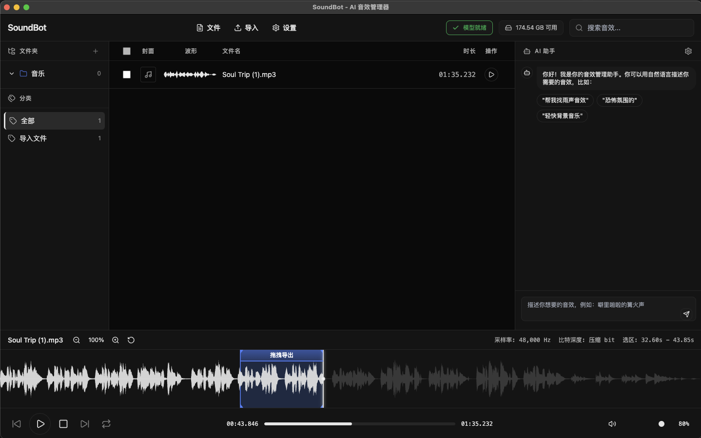
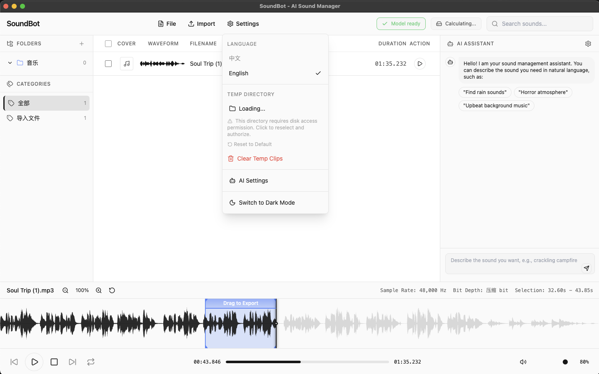

# 🎵 SoundBot - AI 音效管理器 / AI Sound Effect Manager

[](https://www.gnu.org/licenses/gpl-3.0)
[](https://github.com/Huckrick/SoundBot/releases/tag/v0.2.1-beta.2)
[](https://www.python.org/)
[](https://www.electronjs.org/)

[English](README.en.md) · [更新日志](CHANGELOG.md) · [版本发布](https://github.com/Huckrick/SoundBot/releases) · [GPL-3.0-or-later](LICENSE)

> 用自然语言找到你想要的声音——本地优先、AI 驱动的桌面音效管理器。

SoundBot 使用 Electron 提供桌面界面，以 FastAPI、SQLite、PyAV 和 Chroma 组成随应用冻结的本地后端，支持音效导入、真实波形、播放、标签、项目隔离、双索引检索和可选的 AI 助手。

***

## 📥 下载

**最新测试版本：** [SoundBot v0.2.1-beta.2](https://github.com/Huckrick/SoundBot/releases/tag/v0.2.1-beta.2)

当前源码版本为 **v0.2.1-beta.2（预发布）**。本版本修复 Windows 安装版沙箱 preload 崩溃引发的文件/文件夹导入与波形不可用，并将固定 revision 的 CLAP 模型、PyAV/FFmpeg 音频运行时和完整校验信息一并装入安装包。

| 资源 | 适用环境 | 下载 |
| --- | --- | --- |
| macOS 安装包 | macOS 14+、Apple Silicon arm64 | [在 v0.2.1-beta.2 Release 中下载 DMG](https://github.com/Huckrick/SoundBot/releases/tag/v0.2.1-beta.2) |
| Windows 安装包 | Windows 10/11 x64 | [在 v0.2.1-beta.2 Release 中下载 EXE](https://github.com/Huckrick/SoundBot/releases/tag/v0.2.1-beta.2) |
| CLAP 修复/开发资源 | 两个平台通用；必须与应用版本完全匹配 | [在对应 Release 中下载可选的 `models.zip`](https://github.com/Huckrick/SoundBot/releases) |

> 这是测试版本。升级前请备份 SoundBot 用户数据目录。v0.2.1-beta.2 安装包已内置固定 revision 的 CLAP 模型、逐文件 manifest 与 Apache-2.0 许可说明，普通用户无需另行下载 `models.zip`。模型加载异常时，文件仍会安全保存在 SQLite 中，基础管理、波形、播放、标签和关键词检索仍可使用。

### 界面预览





***

## ✨ 功能特性

| 能力 | v0.2.1-beta.2 行为 |
| --- | --- |
| 文件导入 | 沙箱化 preload 通过最小 IPC bridge 调用原生文件/文件夹选择器并只提交绝对路径；后端先写入 SQLite，再由可取消、可轮询的持久化作业生成波形和两个向量 |
| 音频解码 | 固定版本 `av==18.0.0`（PyAV）及其 wheel 内 FFmpeg 动态库统一解码，不依赖系统 `ffmpeg` 命令 |
| 波形 | 生产 preload bridge 从后端按需取得每个文件固定 2,000 个有限、非负、位于 `[0,1]` 的峰值；源文件或波形算法变化时自动失效 |
| 播放 | Chromium 可播放的格式直接使用 Electron Audio；不兼容的容器按需转成有指纹、受 LRU 限额管理的临时 WAV |
| 数据与项目 | SQLite v3 是文件、波形和索引状态的唯一真相源；文件和索引按 `project_id` 隔离 |
| 双索引 | 原始声音使用 CLAP 音频编码；文件名、逻辑目录、标签、UCS 分类与描述进入独立文本元数据索引 |
| 搜索 | 音频 CLAP 0.55、文本元数据 0.30、关键词/UCS 0.15；不可用分支自动重新归一化 |
| 索引维护 | 提供状态、修复缺失项和完整重建；完整重建写入影子 collection，验证后才原子切换 |
| AI 助手 | 支持本地或 OpenAI-compatible LLM；AI 不可用时直接用原始查询执行本地搜索 |
| 隐私 | 无云端遥测；外部 LLM/Embedding 只有在用户主动配置后才会接收相关文本 |
| 启动诊断 | 沙箱化 preload 完成握手且后端音频运行时自检通过后才显示主界面；统一风格的启动窗口会明确显示故障并写入持久日志 |

***

## 🚀 安装与快速使用

### 安装

1. 在 [v0.2.1-beta.2 Release](https://github.com/Huckrick/SoundBot/releases/tag/v0.2.1-beta.2) 下载与你平台对应的安装包。
2. macOS 打开 DMG 并将 SoundBot 拖入“应用程序”；Windows 运行 EXE 并按安装向导完成安装。
3. v0.2.1-beta.2 安装包已经包含经过校验的 CLAP 模型；首次启动即可使用语义音频索引，无需另外下载或放置 `models.zip`。
4. 外部 LLM 和文本 Embedding 均为可选能力，只有在设置页主动配置后才会联网。

### 快速使用

1. 创建或选择工程，再通过“导入文件夹”或“导入文件”加入音效库。
2. 导入作业会先保存文件记录，再生成波形和索引；切换工程不会把任务写入其他工程。
3. 点击音效卡片预览，使用主波形选择片段；关键词搜索无需模型即可工作。
4. 安装包内置 CLAP 模型并启用语义音频搜索；索引状态页可执行“修复缺失项”或非破坏性的“完整重建”。
5. AI 助手不可用时，查询会自动回退到本地双索引与关键词搜索。

***

## 🖥️ 支持平台

v0.2.1-beta.2 的正式构建目标只有：

- Windows 10/11 x64；
- macOS 14 或更高版本、Apple Silicon arm64。

本版本不提供 Linux、macOS Intel/x64 或跨系统构建。PyInstaller 后端包含平台原生二进制，因此 Windows 包必须在 Windows x64 构建，macOS 包必须在 Apple Silicon macOS 构建。构建脚本会在清理和打包前拒绝错误的宿主或架构。

***

## 🎧 音频格式、波形与播放

扫描器、文件选择器、后端解码、波形、索引和播放回退共用同一份音频能力表。正式支持以下 9 个扩展名：

| 格式 | 扩展名 | 后端解码 | 默认播放路径 |
| --- | --- | --- | --- |
| WAV | `.wav` | PyAV/FFmpeg | 原文件 |
| MP3 | `.mp3` | PyAV/FFmpeg | 原文件 |
| FLAC | `.flac` | PyAV/FFmpeg | 原文件 |
| AIFF | `.aiff`、`.aif` | PyAV/FFmpeg | 按需 WAV |
| Ogg Vorbis | `.ogg` | PyAV/FFmpeg | 原文件 |
| M4A | `.m4a` | PyAV/FFmpeg | 按需 WAV |
| AAC | `.aac` | PyAV/FFmpeg | 按需 WAV |
| WMA | `.wma` | PyAV/FFmpeg | 按需 WAV |

冻结后端会显式收集 PyAV 扩展、`avcodec`、`avformat`、`avutil`、`swresample`、`swscale` 及第三方许可证。Windows 发布门禁会把 `PATH` 缩减到系统目录，在没有系统 FFmpeg 的环境中逐格式真实解码。

波形数据契约如下：

- `null` 表示尚未加载；空数组不是有效波形；
- 成功结果必须是非空且全部有限的数值数组；固定为 2,000 点，范围 `[0,1]`；
- 缓存指纹由文件大小、`mtime_ns` 和 `waveform_version` 组成；文件改变后旧峰值不会继续显示；
- 静音、短文件、多声道和超长文件使用同一确定性降采样流程；长文件通过有界临时缓冲处理，不把整段 PCM 常驻内存；
- 界面显示 loading、失败原因和重试状态，不生成伪随机波形；较早请求返回后不会覆盖当前选择的状态；
- Canvas 按 `devicePixelRatio` 和 `ResizeObserver` 调整，静态波形使用离屏缓存，播放头和选区单独重绘。

播放用 WAV 缓存默认最多 128 个文件、512 MiB。缓存键包含源文件指纹，源文件变化后会生成新文件；缓存满时按最近最少使用策略清理。

***

## 💾 数据库、迁移与 artifact 状态

SQLite v3 是唯一真相源。`indexed_files_meta.json` 不再参与索引判断；Chroma 只保存可重建的向量数据。

从旧数据库第一次升级时：

1. 在数据库旁创建一次不可变快照 `soundmind.db.pre-v<旧版本>-to-v3.bak`；同一迁移不会重复覆盖该备份；
2. 在事务内保留项目、文件、标签、波形、文件夹映射和临时目录设置；
3. 为文件补充项目内 UUID、Windows/UNC 感知的规范化路径键和源文件指纹；POSIX 符号链接别名会按同一物理路径安全合并，同时保留信息最完整的 UUID、标签、波形与 artifact 状态；不安全的旧项目 ID 会映射为安全 ID；
4. 新建 `file_artifacts`、`index_manifests` 和 `jobs`，并执行 SQLite `quick_check`；
5. 迁移失败时回滚事务、保留原库与备份并停止启动，不自动清库。

不要为修复索引而删除 `soundmind.db`。需要回退数据库时，先完全退出 SoundBot，再备份整个用户数据目录；避免只复制正在使用的 SQLite 文件。

每个文件分别记录三类 artifact：

- `waveform`：2,000 点波形及其源文件/算法指纹；
- `audio_vector`：CLAP 对原始声音生成的向量；
- `text_vector`：文件名、逻辑目录、标签、UCS 分类和描述生成的向量。

artifact 状态为 `pending`、`processing`、`ready`、`failed` 或 `stale`，失败项会保留错误码和错误信息。进程意外终止后，遗留的 `processing` 会在下次启动恢复为可处理的 `pending`，未完成作业会标记为中断，而不是把文件误计为已索引。

***

## 🧠 CLAP + 文本元数据双索引

SoundBot 不把普通文本 embedding 宣称为音频编码器：

- 音频索引始终由本地 `laion/larger_clap_general` CLAP 模型读取原始声音。处理器窗口决定确定性分窗，窗口向量聚合后归一化，不使用随机截断；
- 文本元数据索引默认使用同一 CLAP 的文本编码器，也可选择 LM Studio、Ollama 或 OpenAI-compatible Embeddings API；
- 更改文本 embedding provider、模型或维度只会使文本索引变为 `stale`，不会破坏音频索引；
- 新 collection 固定使用 cosine metric，分数为 `similarity = 1 - distance`；旧平方 L2 collection 不会与新结果混用；
- manifest 记录模型 ID、固定 revision、维度、预处理版本、引擎指纹、cosine metric、collection 名和 revision；指纹不匹配时拒绝复用旧向量。

混合搜索的默认分支权重为：

```text
最终分数 = 音频 CLAP × 0.55 + 文本元数据 × 0.30 + 关键词/UCS × 0.15
```

如果 CLAP 模型或文本服务不可用，剩余分支会按比例重新归一化。搜索响应在结果 `metadata` 中返回 `audio_score`、`text_score`、`keyword_score` 和实际 `score_weights`，便于诊断排序来源。缓存键包含项目、查询、过滤、索引 revision、模型指纹和分页参数。

### 修复缺失项与完整重建

项目索引状态会分别显示波形、音频索引、文本索引的 ready、pending/stale 和 failed 数量。

- **修复缺失项（reconcile）**：核对 SQLite 与当前 collection，补算 pending/failed/stale 项，移除孤立向量；不会清空可用索引。
- **完整重建（rebuild）**：在新的影子 collection 中重建选定索引。只有数量、cosine metric 和 manifest 都验证通过后，SQLite 才在一个事务中切换激活 collection；失败或取消时继续使用旧 collection。

导入、修复和重建在创建作业时捕获不可变的 `project_id`。即使处理中切换界面项目，SQLite、Chroma、搜索缓存和 AI 搜索器也不会切到另一项目。

***

## 🤖 LLM 与文本 Embedding

v0.2.1-beta.2 正式启用以下 LLM 入口：

- LM Studio；
- Ollama；
- OpenAI；
- Kimi（Moonshot）；
- DeepSeek；
- SiliconFlow；
- 自定义 OpenAI-compatible API。

Azure OpenAI、Google Gemini、Anthropic 和 Kimi Coding 在本版本隐藏。旧配置块会保留以便未来迁移，但不会被选为当前 provider。

LLM 请求使用共享异步 HTTP 客户端，支持流式 SSE 跨 chunk 缓冲、取消、连接/响应超时和有限重试。正常聊天不会在每次调用前重复探测服务；设置页的“测试连接”才会主动检查。LLM 失败时，AI 搜索直接以用户原始查询执行本地双索引/关键词检索。

文本 Embedding 可选择：

- `default`：内置 CLAP 文本编码器；
- `local`：LM Studio 或 Ollama 的 embeddings 端点；
- `external`：OpenAI 或其他 OpenAI-compatible embeddings 端点。

外部文本 Embedding 只处理元数据文本，不替代 CLAP 音频编码，也不会上传原始音频。

***

## 📦 内置模型与校验

v0.2.1-beta.2 Windows/macOS 安装包自带语义音频索引所需的 CLAP 模型。模型 ID 与不可变 commit revision 由 `config/model_bundle.json` 统一固定，安装资源包含逐文件 SHA-256 manifest 以及完整的 Apache-2.0 来源与许可说明：

```text
models/
├── model-manifest.json
├── CLAP_MODEL_NOTICE.txt
└── clap/
    ├── config.json
    ├── preprocessor_config.json
    └── ...
```

普通桌面用户只需安装应用，不需要下载 `models.zip`。Release 中单独提供的 `models.zip` 与 `models.zip.sha256` 仅用于相同应用版本的离线修复、构建和源码开发；不要把其他版本的模型资源混入安装。已安装应用的内置资源损坏时，首选重新安装同版本安装包。源码环境可用资源下载器执行精确版本下载，它会检查压缩包 SHA-256、manifest 内逐文件 SHA-256、固定 revision、目录边界和 Zip Slip，并在暂存目录验证后原子替换：

```bash
python scripts/download_manager.py download models --tag v0.2.1-beta.2
python scripts/download_manager.py check
```

源码环境默认使用仓库的 `models/`；打包后的桌面应用默认使用应用 `resources/models/` 内的只读副本，而不是用户数据目录。`SOUNDBOT_MODELS_PATH` 可在受控修复、开发或测试时指向包含上述结构的绝对路径；这个显式值具有最高优先级且是权威配置，即使它指向缺失或损坏的目录也不会静默回退到安装包模型。使用后请移除错误的环境变量。不要把 mutable branch/tag 当作发布模型 revision，也不要使用缺少 manifest、逐文件校验或许可说明的未知模型包。

后端只从已校验的本地目录加载 CLAP，并使用 manifest 的 revision 与逐文件 SHA 生成引擎指纹；不会在请求路径访问 Hugging Face。构建和发布会先生成并校验模型树，再把同一份资源复制进最终应用并重新执行逐文件哈希校验。模型加载异常不会清库；状态轮询检测到资源变化并成功加载后，会为所有工程创建持久化 reconcile 作业，补算 `pending`、`failed` 或 `stale` 的音频与默认 CLAP 文本向量。

***

## 🔐 密钥、隐私与网络边界

API 密钥由 Electron `safeStorage` 使用操作系统安全能力加密后保存在 Electron 用户数据目录。渲染层只提交 `keep`、`set` 或 `clear` 意图：

- 已保存密钥不会回显，配置读取只返回 `has_api_key`；
- Python 后端只在当前进程内存中接收所选 provider 的密钥，`ai_config.json`、日志、导出配置和 API 响应不会持久化或返回密钥及敏感 header；
- 旧 `ai_config.json` 中的明文密钥会在后端启动前迁移。已有 safeStorage 值优先；迁移采用临时文件和原子替换，任何一步失败都会恢复安全存储快照并保留原文件；
- 操作系统安全存储不可用时，保存密钥会明确失败，不会降级为伪装的明文存储。

SoundBot 不包含云端遥测。文件路径、标签、波形、CLAP 音频和 Chroma 数据默认留在本机。选择外部 LLM 时，聊天内容、搜索上下文或候选元数据可能发送给该 provider；选择外部文本 Embedding 时，组成索引的元数据文本会发送给该 provider。服务费用、留存和合规策略由对应提供商决定。

***

## 🗂️ 用户数据与日志

默认用户数据目录：

| 平台 | 目录 |
| --- | --- |
| macOS | `~/Library/Application Support/SoundBot/` |
| Windows | `%APPDATA%\SoundBot\`（无 `APPDATA` 时回退到用户 Roaming 目录） |

主要内容：

```text
SoundBot/
├── db/soundmind.db                         # SQLite v3 真相源
├── db/soundmind.db.pre-v*-to-v3.bak       # 首次迁移快照（如发生迁移）
├── chroma_projects/<project_id>/           # 项目隔离的 Chroma collections
├── logs/soundmind_YYYYMMDD.log             # 后端日志
├── temp/                                   # 临时片段与按需播放 WAV
├── ai_config.json                          # 不含密钥的 AI 元数据配置
├── user_config.json                       # 全局临时目录等本地用户设置
└── secure_secrets.json                     # safeStorage 加密后的密文，不是明文密钥
```

Electron 主进程另外把启动、preload、IPC 与冻结后端输出持久化到操作系统的应用日志目录：`soundbot-main.log` 超过 5 MiB 后轮换为 `.1`，写入前会遮盖常见 API key 与 Bearer token。诊断入口可通过主进程打开这个实际目录，不需要猜测安装路径。

测试或便携诊断可以设置 `SOUNDBOT_USER_DATA_DIR` 覆盖数据目录。安装包模型位于应用资源目录，不属于上述用户数据树；`SOUNDBOT_MODELS_PATH` 是单独且权威的模型目录覆盖。不要在应用运行期间手工编辑 SQLite、Chroma 或安全存储文件。

### 诊断顺序

遇到“文件存在但没有波形/搜索结果”时：

1. 查看项目索引状态，分辨 `waveform`、`audio_vector` 和 `text_vector` 哪一项 pending/stale/failed；
2. 先使用“修复缺失项”，并在作业状态中查看阶段、进度和最后错误；
3. 只有 metric、模型或维度改变，或 reconcile 仍不能恢复时，才使用“完整重建”；
4. 查看后端当天的 `logs/soundmind_YYYYMMDD.log`，并通过 Electron 诊断入口打开 `soundbot-main.log`；日志只用于本机排查，分享前仍应检查路径和私人内容；
5. 调用 `/api/v1/health`、`/api/v1/runtime/capabilities` 与 `/api/v1/model/status`，分别确认后端身份、必需的 PyAV/FFmpeg 解码能力和可选的 CLAP 加载状态；
6. Windows 上确认安全软件没有隔离 `soundbot-backend.exe`，但不需要安装系统 FFmpeg。

本仓库不接收诊断文件、音频样本、数据库、API 密钥或私人路径；请勿通过任何 GitHub 公共或私密入口提交这些内容。

***

## 🛠️ 开发环境

建议使用：

- Python 3.12；
- Node.js 20；
- 与目标相同的原生宿主：Windows x64 或 macOS 14+ Apple Silicon。

```bash
python -m venv .venv
# macOS: source .venv/bin/activate
# Windows PowerShell: .\.venv\Scripts\Activate.ps1
python -m pip install -r backend/requirements.txt
npm ci
```

`backend/requirements.in` 只列应用直接依赖，`backend/requirements.txt` 是包含 Chroma 必需传递项的解析锁，PyInstaller 等构建工具单独位于 `backend/requirements-build.txt`。

开发模式仍需要先生成当前宿主的冻结后端：

```bash
python scripts/build.py --skip-electron
npm start
```

***

## 🏗️ 原生构建

构建脚本会统一验证版本、安装/检查依赖、冻结后端、检查 PyAV/FFmpeg/许可证，校验固定 revision 的 CLAP 模型及 Apache-2.0 说明，构建 Electron，并在最终包中重新验证原生后端和模型的逐文件 SHA-256。

正式构建前先按 `config/model_bundle.json` 生成并完整校验本地模型树；该命令只接受配置中的不可变 revision：

```bash
python scripts/download_models.py
```

Apple Silicon macOS：

```bash
python scripts/build.py --platform macos
```

Windows x64：

```powershell
python scripts/build.py --platform windows
```

也可以用 `python scripts/build.py` 构建当前受支持宿主。`--skip-backend` 和 `--skip-electron` 只用于已有中间产物的调试；正式发布不要跳过任一阶段。输出位于 `dist-electron/`。

本仓库不会在 macOS 上伪造 Windows 包，也不会在 Windows 上生成 macOS 包。Windows 结果以 Windows CI runner 的门禁为准，本文不声称已在当前开发机完成 Windows 构建。

### 发布门禁

`.github/workflows/build.yml` 只有在全部检查通过后才创建预发布 Release：

- `package.json`、`package-lock.json`、`backend/config.py`、tag、双语 changelog 版本同步；
- 模型配置只有一个版本控制来源；在打包前生成并校验固定 commit revision、逐文件 manifest、Apache-2.0 说明和 `models.zip.sha256`，再把同一模型树内置到两个平台的应用资源；
- macOS arm64 和 Windows x64 分别在原生 runner 冻结后端并打包；
- 冻结包必须包含正确架构的后端、PyAV 扩展、wheel 内 FFmpeg 动态库和第三方许可证；
- 两个平台的最终应用必须重新通过内置模型 ID、revision、许可说明和 manifest 逐文件哈希校验；五个 Release 资产中任一个达到 2 GiB 时直接拒绝发布；
- Windows 在干净 `PATH`、无系统 FFmpeg 下覆盖 WAV、MP3、FLAC、AIFF、AIF、OGG、M4A、AAC、WMA，包含空格、中文、`%`、`_`、`#`、`+` 和括号路径；
- 同一 Windows smoke test 检查 2,000 点波形、SQLite artifact、CLAP、Chroma cosine collection、混合搜索分项得分和 WMA 按需 WAV；
- `win-unpacked` 内后端再次启动并执行真实波形测试；随后静默安装真实 NSIS 到包含空格和中文的路径，启动已安装的 Electron，通过生产 preload/IPC 让应用自身启动冻结后端，验证文件与文件夹原生选择器真实弹出、WAV/WMA 导入、SQLite 列表、三份 2,000 点波形、WMA 播放转码、内置 CLAP 加载、双索引和语义搜索；
- macOS DMG、应用内 arm64 后端和 `app.asar` 资源必须通过完整性检查，应用资源中的固定 CLAP 必须在离线模式下真实加载；
- 任一功能 smoke test 失败，Release 作业不会运行。

Release 工作流只接受 annotated `v*` 版本标签的推送，不提供手动触发入口。发布标签必须事先存在，且对应提交必须可从默认分支达到；所有 job 都绑定同一 tag commit，并在打包前重跑全量源码与渲染层契约。工作流先创建草稿 Release，上传模型包及校验、DMG、EXE 和统一 `SHA256SUMS.txt`，核对远端名称、大小、SHA-256 与上传状态，并生成 provenance attestation 后才公开；若该 tag 已有 Release 或草稿则拒绝覆盖，避免重跑混入旧资产。不可变的 v0.2.0 保留为历史预发布；当前 v0.2.1-beta.2 及后续带 SemVer 预发布后缀的版本进入预发布渠道，稳定版本自动进入正式渠道。

最短发布顺序：先运行 `python scripts/bump_version.py --version X.Y.Z --write`，填完 changelog 占位内容并提交；等待 main 上的 `Validate / Source contracts` 通过后，执行 `git tag -a vX.Y.Z -m "SoundBot vX.Y.Z"` 和 `git push origin vX.Y.Z`。不要使用 lightweight tag。

***

## 🧪 测试

Python 单元与集成测试：

```bash
python -m unittest discover -s tests -p 'test_*.py' -v
python -m unittest discover -s tests/build -p 'test_*.py' -v
```

Electron/渲染层契约与语法：

```bash
node --check main.js
node --check preload.js
node --check assets/i18n.js
node tests/frontend/check_renderer_contract.js
npx --no-install electron tests/frontend/check_electron_preload.js
```

发布元数据与 PyInstaller 环境：

```bash
python tests/build/verify_release_metadata.py --expected-version 0.2.1-beta.2
python scripts/bump_version.py --version 0.2.1          # 预览，不写文件
python scripts/bump_version.py --version 0.2.1 --write  # 原子同步全部版本源
python scripts/test_pyinstaller.py
python scripts/test_pyinstaller.py --build
```

冻结后端全格式/CLAP/Chroma 测试由 CI 在受控端口和临时用户数据目录运行，入口为 `tests/build/check_frozen_audio_matrix.py`。它需要已启动的冻结后端和已校验的 CLAP 模型，不应被当作普通源码单元测试直接运行。

***

## 🔌 公共 API 摘要

后端默认只监听 `127.0.0.1`，Electron 会在默认端口被占用时选择本机可用端口。运行时地址应从 preload/runtime config 获取，不要在扩展代码中写死端口。

| 方法与路径 | 用途 |
| --- | --- |
| `GET /api/v1/health` | 后端版本、设备、模型加载状态与必需的 `audio_decoder_available`；解码器缺失时为 `degraded` |
| `GET /api/v1/runtime/capabilities` | 不暴露本地路径的 PyAV/FFmpeg 运行时详情、支持扩展名与可选语义搜索状态 |
| `GET /api/v1/model/status` | CLAP 预加载状态与可用性 |
| `GET /api/v1/files?project_id=&limit=&cursor=` | 游标分页元数据；默认 200、最大 500，不返回峰值 |
| `GET /api/v1/files/{file_id}/waveform?project_id=` | 单文件波形 |
| `POST /api/v1/waveforms/batch` | 最多 100 个文件的批量波形；每项独立成功/错误 |
| `GET /api/v1/files/{file_id}/playback-source?project_id=` | 返回原路径或有指纹的临时 WAV |
| `POST /api/v1/projects/{project_id}/imports` | 二选一提交 `folder_path` 或最多 1,000 个 `file_paths`，返回持久化 job ID |
| `GET /api/v1/jobs/{job_id}` | 获取作业 state、stage、total、processed 和最后错误 |
| `DELETE /api/v1/jobs/{job_id}` | 请求取消仍在运行的作业 |
| `GET /api/v1/projects/{project_id}/index/status` | artifact 计数和两个激活 manifest |
| `POST /api/v1/projects/{project_id}/index/reconcile` | 非破坏性修复缺失/失败/过期项 |
| `POST /api/v1/projects/{project_id}/index/rebuild` | 使用影子 collection 完整重建 |
| `POST /api/v1/search` | 显式项目、过滤和分页的混合搜索 |
| `GET/POST /api/v1/ai/config` | 读取脱敏配置或更新当前进程配置 |
| `POST /api/v1/ai/chat` | 携带显式 `project_id` 的 AI 搜索/聊天 |

文件夹导入也必须使用显式的工程路由；旧 `POST /api/v1/import/async` 从 v0.2.0 起仅作为当前工程的兼容适配层，并保留一个兼容周期。兼容路径 `GET /api/waveform?path=...` 同样保留一个版本；新代码应使用文件 UUID 路径。结构化错误统一为：

```json
{
  "code": "file_not_found",
  "message": "文件不存在",
  "retryable": false,
  "details": {}
}
```

***

## ⚠️ 已知限制

- v0.2.1-beta.2 是预发布版本；安装包尚不保证生产级代码签名、公证或自动更新体验。
- 只支持 Windows x64 与 macOS arm64；Linux 和 Intel Mac 不在测试、构建或支持范围内。
- CLAP 模型体积较大，首次索引和 CPU 推理可能较慢；模型 worker 会串行化推理以避免并发争用。
- 模型或外部服务缺失时，相关向量会保持 pending/failed；基础管理、解码、波形、播放和关键词搜索仍可用。
- Chromium 原生解码能力随平台不同，AIFF/AIF、M4A、AAC 和 WMA 会使用临时 WAV，因此需要额外磁盘空间。
- 外部 LLM/Embedding 的网络可用性、限流、费用、模型行为和数据政策不由 SoundBot 控制。
- 直接在浏览器打开 `index.html` 只能预览界面；真实导入、safeStorage 和本地协议需要 Electron。

***

## 📁 仓库结构

```text
SoundBot/
├── index.html                   # Electron 渲染界面
├── assets/renderer/             # API、状态、音频、波形、搜索、项目和设置模块
├── main.js                      # 主进程、后端生命周期、协议、safeStorage 与 IPC
├── preload.js                   # contextBridge 最小权限接口
├── backend/                     # FastAPI、SQLite、PyAV、CLAP、Chroma 与 LLM
├── scripts/build.py             # 原生宿主一体化构建
├── tests/                       # 后端、集成和安全测试
└── tests/build/                 # 冻结运行时与发布门禁
```

***

## 📝 关于本项目

- 开发者：**Nagisa_Huckrick（胡杨）**
- 项目方向：本地优先的音效资产管理、波形预览、语义检索与可选 AI 助手
- 开发方式：产品构思、交互设计与测试由作者负责，代码实现使用 AI 编程工具辅助完成

> 项目质量以可复现的自动构建、冻结运行时测试和经过校验的发布资产为准；未通过发布门禁的“已修复”描述不会作为发布结论。

## 📄 许可证

SoundBot 使用 [GNU General Public License v3.0 或更高版本](LICENSE)。

```text
Copyright (C) 2026 Nagisa_Huckrick (胡杨)
```

## 🙏 致谢

### AI 开发协作

SoundBot 的产品方向、技术取舍、代码验收与最终发布由维护者负责。感谢以下 AI 工具在不同阶段参与研究、实现、审查或测试；列名仅表示曾用于开发协作，不代表对应厂商对本项目背书、共同署名或承担维护责任：

- [OpenAI Codex](https://openai.com/codex/)：代码库审计、实现、测试、跨平台构建与发布流程协作
- [Kimi](https://www.kimi.com/)（Moonshot AI）：研究、方案梳理与开发协作
- [Claude](https://www.anthropic.com/claude)（Anthropic）：代码分析、审查与开发协作
- [Trae](https://www.trae.ai/) 与 [Cursor](https://www.cursor.com/)：AI 编程环境与早期实现辅助

### 核心技术与工程工具链

- [Electron](https://www.electronjs.org/)（Chromium + Node.js）、[Tailwind CSS](https://tailwindcss.com/) 与 [Lucide](https://lucide.dev/)：桌面运行时、界面样式与图标
- [Python](https://www.python.org/)、[FastAPI](https://fastapi.tiangolo.com/)、[Uvicorn](https://www.uvicorn.org/)、[Pydantic](https://docs.pydantic.dev/) 与 [HTTPX](https://www.python-httpx.org/)：类型化本地 API 与异步服务层
- [SQLite](https://www.sqlite.org/) 与 [Chroma](https://www.trychroma.com/)：本地元数据、任务状态与项目隔离向量索引
- [PyTorch](https://pytorch.org/)、[Hugging Face Transformers](https://huggingface.co/docs/transformers/) 与 [LAION CLAP](https://huggingface.co/laion/larger_clap_general)：音频/文本向量编码与语义检索
- [NumPy](https://numpy.org/)、[PyAV](https://pyav.org/) 与 [FFmpeg](https://ffmpeg.org/)：音频解码、重采样、波形和播放回退
- [Mutagen](https://mutagen.readthedocs.io/)、[TinyTag](https://github.com/tinytag/tinytag) 与 [jieba](https://github.com/fxsjy/jieba)：音频元数据与中文关键词处理
- [PyInstaller](https://pyinstaller.org/)、[electron-builder](https://www.electron.build/) 与 [GitHub Actions](https://github.com/features/actions)：原生后端冻结、桌面安装包与可复现发布门禁

### 分类体系与资料

- [Universal Category System](https://universalcategorysystem.com/)（UCS）社区：音效分类与命名体系
- Bilibili 作者[宇宙人和太空人](https://www.bilibili.com/read/cv23153650/)：仓库内 UCS 音效分类中英文对照表的注明来源；资料权利仍归原作者与 UCS 社区所有

## 🔒 仓库政策

- 版本下载：[GitHub Releases](https://github.com/Huckrick/SoundBot/releases)
- 更新记录：[CHANGELOG.md](CHANGELOG.md)
- 政策文件：[CONTRIBUTING.md](.github/CONTRIBUTING.md) · [SECURITY.md](.github/SECURITY.md)

本仓库用于公开源码、审计和发布，不开放 Issue、Pull Request、Discussion、Project、私密漏洞报告或其他外部提交入口，也不接收支持请求、代码、诊断数据和个人数据。依据 GPL-3.0-or-later 可以 fork 和修改，但 fork 不拥有本仓库写权限。

***

<p align="center">
  Made with ❤️ by Nagisa_Huckrick（胡杨）with AI-assisted development<br>
  使用 AI 编程工具辅助制作
</p>
